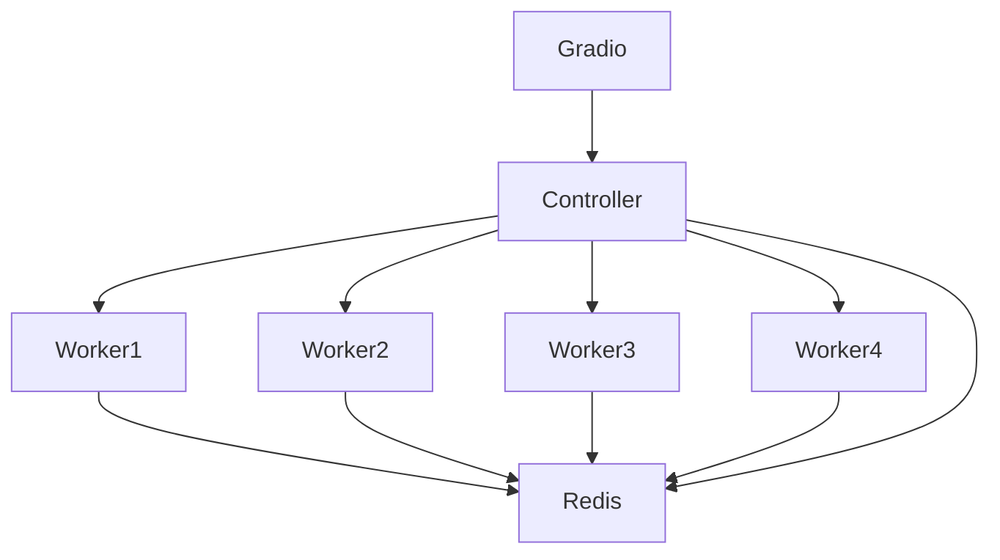

# PyramidSWARM


Welcome to **PyramidSWARM**, a distributed AI-powered video generation system using the **PyramidFlow** model. This repository sets up a controller-worker architecture to process large-scale inference tasks across multiple GPUs, making it perfect for scalable AI workloads.

## Key Features

- **Distributed Inference**: Use one controller node and multiple worker nodes to split and process video generation tasks efficiently across multiple GPUs.
- **Powered by PyTorch**: Leverages PyTorch 2.4.1 with CUDA 12.4 and cuDNN 9 for optimized GPU computation.
- **Gradio Interface**: A simple web interface for interacting with the system, allowing you to submit prompts and customize inference parameters.
- **Tagging and Metadata**: Automatically adds tags and metadata to generated outputs.

## Getting Started

### Prerequisites

- **Docker** and **Docker Compose** installed on your system.
- **NVIDIA GPU drivers** and **CUDA support** for running PyTorch with GPU acceleration.
- (Optional) Access to multiple machines for distributed workloads.

### Installation

1. Clone the repository:

    ```bash
    git clone https://github.com/djstompzone/PyramidSWARM.git
    cd PyramidSWARM
    ```

2. Build and run the containers:

    ```bash
    docker-compose up --build
    ```

### Example Usage

Once the system is running, visit the [Gradio interface](`http://localhost:7860`) and enter your desired prompt and settings, such as:

- **Resolution** (High or Low)
- **Temperature** (Slider between 1-31)
- **Guidance Scale** (Slider between 1-15)
- **Frames Per Second** (Slider between 8-24)

The backend system will distribute the task across the available worker nodes, process it, and return the generated video.

## System Architecture

### Components

- **Gradio Frontend**: A user-facing web interface to interact with PyramidSWARM.
- **Controller Node**: Coordinates the inference tasks and distributes them to the worker nodes.
- **Worker Nodes**: Perform the actual AI processing and send results back to the controller.
- **Redis**: Used for managing task queues and coordinating the workload.



This **Mermaid** diagram outlines the architecture of PyramidSWARM:

- **Gradio** handles user input and sends inference tasks to the **Controller**.
- The **Controller** splits tasks and assigns them to multiple **Worker** nodes.
- **Redis** helps manage the task queue, and all nodes interact with it for coordination.

## Docker Compose Overview

- **Controller Node**: Distributes tasks and aggregates results.
- **Worker Nodes**: Perform inference tasks using the **PyramidFlow** model.
- **Redis**: Provides task management and job queuing.
- **Gradio Frontend**: Exposes the interface on port `7860`.

### Environment Variables

- `ROLE=controller`: Designates a container as the controller node.
- `ROLE=worker`: Designates a container as a worker node.
- `CUDA_VISIBLE_DEVICES`: Specifies which GPU to use for each container.

## Customization

### Modifying Inference Parameters

You can modify default inference parameters like `num_inference_steps`, `guidance_scale`, and more in the Gradio interface or by editing the `/app/worker.py` file.

### Extending the Architecture

If you need more worker nodes, simply add more services to the `docker-compose.yml` and update the `worker_addresses` in `controller.py` to include them.

## Community and Support

Join the **StompSec** community for discussions, support, and collaboration:

- **GitHub**: [https://github.com/djstompzone/PyramidSWARM](https://github.com/djstompzone/PyramidSWARM)
- **Discord**: [https://discord.stomp.zone](https://discord.stomp.zone)

## License

This project is licensed under the MIT License. See the [LICENSE](LICENSE) file for details.

## Cloud Deployment Examples

PyramidSWARM can be deployed on various cloud platforms, giving you access to powerful GPU resources for distributed AI workloads. Here are general steps for deploying the system using cloud providers for GPU rentals and container hosting services.

### 1. Deploying on a Cloud GPU Rental Service

Many platforms offer GPU rental services that allow you to run GPU-accelerated workloads on virtual machines. You can deploy **PyramidSWARM** on these platforms to leverage high-performance GPUs.

#### Steps

1. **Create a Docker Image**:
   - Build your Docker image locally using the existing Dockerfiles. Tag the image appropriately.

   ```bash
   docker build -t pyramid-swarm:latest .
   ```

2. **Upload Docker Image to a Container Registry**:
   - Push your Docker image to a public or private container registry such as **Docker Hub**, **AWS ECR**, or another provider accessible by your chosen cloud service.

   ```bash
   docker tag pyramid-swarm:latest your-username/pyramid-swarm:latest
   docker push your-username/pyramid-swarm:latest
   ```

3. **Create a Cloud Instance**:
   - Choose a provider and set up an instance with the desired GPU specs.
   - SSH into the instance and pull the Docker image from your container registry:

   ```bash
   docker pull your-username/pyramid-swarm:latest
   ```

4. **Run the Containers**:
   - Execute the following command to start the PyramidSWARM containers:

   ```bash
   docker-compose up --build
   ```

5. **Access the Gradio Interface**:
   - Once the containers are running, you can access the Gradio interface by using the public IP or a port forwarding setup from your chosen cloud provider.

### 2. Deploying Using a Container Hosting Service

For more structured deployments and scaling, you can host your Docker images on a container hosting service such as **AWS ECR**, **Google Cloud Container Registry**, **Azure Container Registry**, or another similar service.

#### Steps

1. **Set Up a Container Registry**:
   - Choose a registry service (AWS ECR, Google Cloud, etc.) and create a repository for your Docker image.

   ```bash
   aws ecr create-repository --repository-name pyramid-swarm
   ```

2. **Build and Push the Docker Image**:
   - Tag and push your Docker image to the registry.

   ```bash
   docker tag pyramid-swarm:latest <your-registry-url>/pyramid-swarm:latest
   docker push <your-registry-url>/pyramid-swarm:latest
   ```

3. **Launch a Cloud Instance**:
   - Use your preferred cloud platform to create a VM with GPU support. Ensure you have proper permissions to pull images from the registry.

4. **Run Docker Compose**:
   - Pull the Docker image from the registry and run it using Docker Compose:

   ```bash
   docker pull <your-registry-url>/pyramid-swarm:latest
   docker-compose up --build
   ```

5. **Configure Networking**:
   - Ensure that your cloud provider’s firewall/security settings allow access to the necessary ports (e.g., 7860 for Gradio, 5000 for the controller).

6. **Access the Gradio Interface**:
   - Use the instance’s public IP and port to access the Gradio interface.
